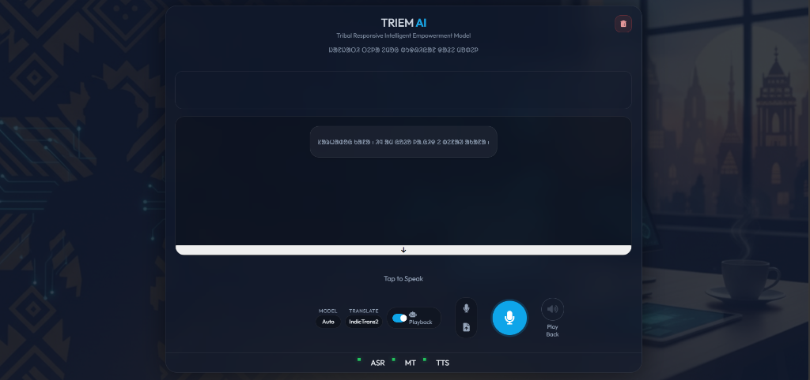
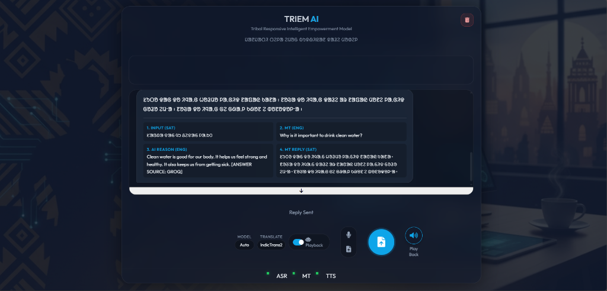
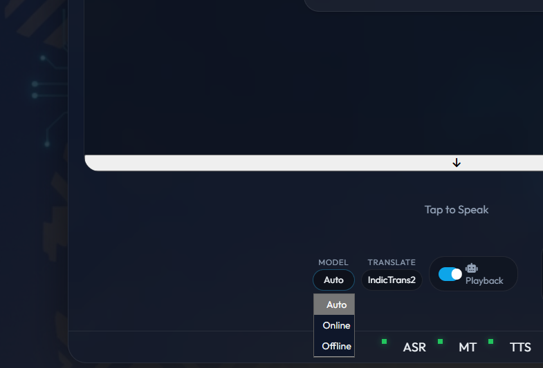
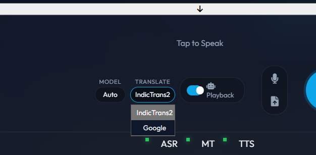
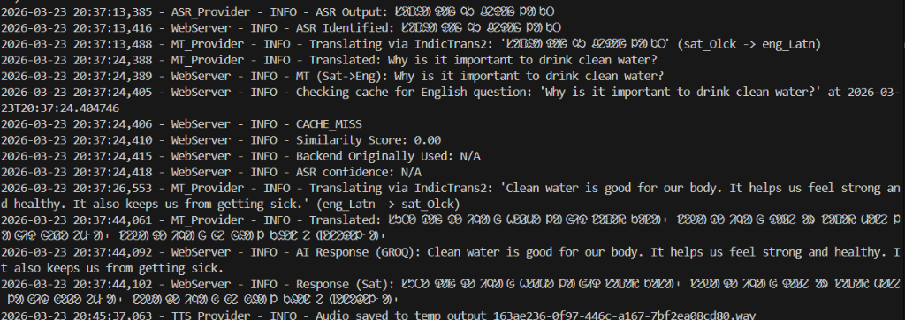
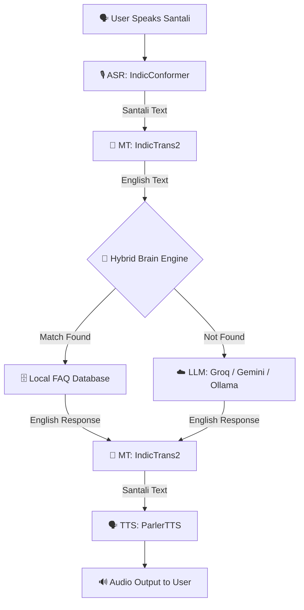
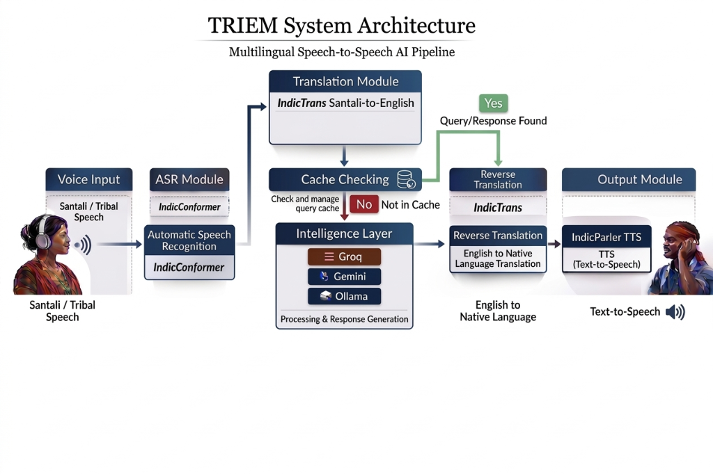

<div align="center">
   <!-- Placeholder for Logo -->
  
  # 🌍 TRIEM – Multilingual AI Voice Assistant for Tribal Communities
  
  **Empowering linguistic minorities with cutting-edge Speech Recognition, Machine Translation, and Generative AI.**
  
  [](https://www.python.org/downloads/)
  [](https://flask.palletsprojects.com/)
  [](https://www.docker.com/)
  [](https://ai4bharat.iitm.ac.in/)
  [](https://huggingface.co/)
  [](#-license)
</div>

---

TRIEM AI is an advanced, multilingual voice assistant designed specifically to bridge language barriers for tribal communities, with a primary focus on **Santali**. It leverages state-of-the-art AI models for Automatic Speech Recognition (ASR), Machine Translation (MT), Generative AI Agents (LLM, RAG), and Text-to-Speech (TTS) to provide a seamless conversational interface.

---

## 📑 Table of Contents
- [✨ Project Highlights](#-project-highlights)
- [📸 Screenshots & Demo](#-screenshots--demo)
- [🌟 Features](#-features)
- [🏗️ Architecture](#-architecture)
- [🛠️ Technology Stack](#-technology-stack)
- [⚙️ Prerequisites](#-prerequisites)
- [🚀 Installation & Setup](#-installation--setup)
- [🐳 Docker Setup](#-docker-setup)
- [🏃 Usage](#-usage)
- [🔌 API Documentation](#-api-documentation)
- [📂 Project Structure](#-project-structure)
- [⚡ Performance](#-performance)
- [🔮 Future Improvements](#-future-improvements)
- [🤝 Contributing](#-contributing)
- [📜 License](#-license)
- [📫 Contact](#-contact)

---

## ✨ Project Highlights
- **Healthcare & Digital Access:** Designed to help tribal communities access digital services and information (e.g., healthcare) in their native language.
- **Hybrid AI Intelligence:** Combines local SQL databases with advanced LLMs (Groq, Gemini, Ollama) for lightning-fast and reliable answers.
- **Offline-First Capabilities:** Utilizes local FAQ caching before hitting external APIs, ensuring robustness.
- **Developer-Friendly:** Easily extendable architecture with a fully documented REST API.

---

## 📸 Screenshots & Demo

### 🎙️ Voice Recording & Speech Recognition
*Real-time intuitive audio interface optimizing engagement for non-technical users.*


### 🤖 AI Conversation Result
*The full conversation pipeline breakdown showing translation context and the final generated AI response.*


### 🧠 Model Selection
*Dropdown UI for seamlessly selecting the preferred generative AI brain (Groq, Gemini, or Offline).*


### 🔄 Translation Output
*Real-time translation provider selection between IndicTrans2 and standard fallbacks.*


### ⚡ Docker Console
*Backend server logs running flawlessly in a Docker container, detailing pipeline latency and RAG caching hits.*


---

## 🌟 Features

*   **🎙️ Santali Speech Recognition (ASR):** Converts spoken Santali into text using **AI4Bharat's IndicConformer**, robust to noisy environments.
*   **🔄 Bidirectional Translation (MT):** Translates between Santali and English using **AI4Bharat's IndicTrans2**, ensuring high-quality semantic understanding.
*   **🧠 Hybrid Intelligence Engine:**
    *   **Local FAQ Caching (RAG):** Instant answers for common questions via SQLite (Offline-first approach).
    *   **Online Intelligence:** Powered by **Groq (Llama 3, Mixtral)** for lightning-fast internet-based queries.
    *   **Fallback Brain:** Uses **Google Gemini 1.5 Flash** or **Ollama** (offline Llama 3) for robust redundancy.
*   **🗣️ Natural Text-to-Speech (TTS):** Responds in natural-sounding Santali using **ParlerTTS**.
*   **🌐 Modern Web Interface:** Clean, responsive Flask-based UI with real-time status indicators and audio visualization.
*   **🖥️ CLI Mode:** Developer-friendly command-line interface for testing and debugging.

---

## 🏗️ Architecture

The system follows a strict, multi-agent processing pipeline:



### 🏛️ Architecture Diagram
*Visual representation of the end-to-end system flow.*


---

## 🛠️ Technology Stack

| Category | Technology |
| :--- | :--- |
| **Backend Framework** | Flask, Python 3.10+ |
| **Speech AI (ASR & TTS)** | AI4Bharat IndicConformer, ParlerTTS |
| **Machine Translation (NLP)** | AI4Bharat IndicTrans2 |
| **Generative AI / LLMs** | Groq (Llama 3), Gemini 1.5 Flash, Ollama |
| **Database (RAG / Cache)** | SQLite |
| **Infrastructure / DevOps** | Docker, FFmpeg, CUDA |

---

## ⚙️ Prerequisites

To run TRIEM AI effectively, your system should meet the following requirements:

*   **OS:** Windows 10/11 (WSL2 recommended but native Windows supported) or Linux.
*   **Python:** Version 3.10 or higher.
*   **GPU:** NVIDIA GPU with at least **8GB VRAM** (Required for local ASR/MT/TTS models).
*   **Tools:**
    *   **FFmpeg:** Essential for audio processing. Must be installed and added to system PATH.
    *   **CUDA Toolkit:** Compatible with your PyTorch version (e.g., CUDA 11.8 or 12.1).

---

## 🚀 Installation & Setup

### 1. Clone the Repository
```bash
git clone https://github.com/your-username/Multilingual-AI.git
cd Multilingual-AI
```

### 2. Set Up Virtual Environment
It is highly recommended to use a virtual environment.

<details>
<summary><b>Windows</b></summary>

```bash
python -m venv .venv
.venv\Scripts\activate
```
</details>

<details>
<summary><b>Linux / macOS</b></summary>

```bash
python3 -m venv .venv
source .venv/bin/activate
```
</details>

### 3. Install Dependencies
This project uses advanced audio libraries. Install PyTorch with CUDA support first.

**Step 3.1: Install PyTorch (CUDA)**  
Visit [pytorch.org](https://pytorch.org/) for the command matching your CUDA version. Example for CUDA 11.8:
```bash
pip install torch torchvision torchaudio --index-url https://download.pytorch.org/whl/cu118
```

**Step 3.2: Install Project Requirements**
```bash
pip install -r requirements.txt
pip install -r requirements_hf.txt
```
> **Note:** NeMo Toolkit and ParlerTTS may take some time to compile.

### 4. Environment Variables (`.env`)
Create a `.env` file in the root directory and add your API keys:

```ini
# .env file
GEMINI_API_KEY=your_gemini_api_key
GROQ_API_KEY=your_groq_api_key
HF_TOKEN=your_huggingface_write_token

# Optional: Configuration overrides
# OLLAMA_MODEL=llama3
```

---

## 🐳 Docker Setup

*(Optional but Recommended for seamless deployment)*

Ensure Docker is installed and running, then build and run the container:

```bash
# Build the Docker image
docker build -t triem-ai .

# Run the container
docker run -p 5000:5000 --gpus all --env-file .env triem-ai
```
The application will be accessible at `http://localhost:5000`.

---

## 🏃 Usage

### Option 1: One-Click Launcher (Windows)
Double-click the `Start_TRIEM_App.bat` file.
*   It automatically starts the **Flask Backend**.
*   It launches the **Web Interface** in your default browser.

### Option 2: Manual Start (Web Server)
Run the Flask server manually:
```bash
python server.py
```
*   Access the interface at: `http://localhost:5000`

### Option 3: Command Line Interface (CLI)
For testing AI models and pipelines without the UI:
```bash
python main_hf.py
```

---

## 🔌 API Documentation

TRIEM provides a robust REST API for integrating with external applications.

### API Swagger / Postman Interface
*Interactive API testing interface.*


### Endpoints

#### `POST /api/chat`
Processes an audio file or text query and returns a synthesized AI response.

**Request Form-Data:**
- `audio`: Audio file (e.g., .wav) containing Santali speech.
- `text` (optional): Direct text input (bypasses ASR).

**Example Response (JSON):**
```json
{
  "status": "success",
  "transcription_santali": "ᱥᱟᱱᱛᱟᱲᱤ ᱛᱮ ᱨᱚᱲ ᱢᱮ",
  "translation_english": "Speak in Santali",
  "ai_response_english": "I am listening to you in Santali.",
  "ai_response_santali": "ᱤᱧ ᱥᱟᱱᱛᱟᱲᱤ ᱛᱮᱧ ᱟᱸᱡᱚᱢᱮᱫ ᱢᱮᱭᱟ",
  "audio_url": "/static/responses/output_1234.wav"
}
```

---

## 📂 Project Structure

```plaintext
Multilingual-AI/
├── src/                    # Core AI Source Code
│   ├── asr_provider.py     # Speech-to-Text Logic (IndicConformer)
│   ├── mt_provider.py      # Translation Logic (IndicTrans2)
│   ├── tts_provider.py     # Text-to-Speech Logic (ParlerTTS)
│   ├── brain.py            # LLM Intelligence (Groq/Gemini/Ollama)
│   ├── faq_database.py     # SQLite Database Manager (RAG)
│   └── config_hf.py        # Configuration Settings
├── web/                    # Web Interface
│   ├── static/             # CSS, JS, Assets
│   └── templates/          # HTML Templates
├── docs/                   # Documentation & Architecture
│   └── images/             # Screenshot Directory
├── scripts/                # Utility & Debug Scripts
├── main_hf.py              # CLI Entry Point
├── server.py               # Flask Web Server REST API
├── requirements.txt        # Basic Dependencies
├── requirements_hf.txt     # Advanced AI Dependencies
└── Start_TRIEM_App.bat     # Windows Launcher
```

---

## ⚡ Performance

- **Inference Speed:** Thanks to **Groq**, LLM inference happens in under ~800ms.
- **ASR & TTS Optimization:** Local models utilize CUDA to transcribe and synthesize speech with < 2 seconds latency (hardware-dependent).
- **Caching:** Sub-100ms response time for repetitive/common FAQ queries.

---

## 🔧 Troubleshooting

<details>
<summary><b>1. <code>RuntimeError: CUDA out of memory</code></b></summary>

*   **Cause:** Your GPU VRAM is full.
*   **Fix:** Close other GPU-intensive apps. Try reducing batch sizes in `src/config_hf.py` if available, or upgrade GPU.
</details>

<details>
<summary><b>2. <code>FFmpeg not found</code></b></summary>

*   **Cause:** FFmpeg is not installed or not in PATH.
*   **Fix:** Download FFmpeg, extract it, and add the `bin` folder to your Windows System Environment Variables "Path".
</details>

<details>
<summary><b>3. <code>ModuleNotFoundError: No module named 'nemo_toolkit'</code></b></summary>

*   **Cause:** NeMo installation failed.
*   **Fix:** NeMo requires `Cython` and specific build tools. Ensure "C++ Build Tools" are installed via Visual Studio Installer.
*   Try: `pip install cython && pip install nemo_toolkit[all]`
</details>

---

## 🔮 Future Improvements

- [ ] Fine-tune ASR models specifically for localized Santali dialects.
- [ ] Integrate a real-time web socket interface for streaming translation.
- [ ] Develop a mobile-friendly frontend using React Native.
- [ ] Expand the Local FAQ database to cover agricultural & legal rights for tribal communities.

---

## 🤝 Contributing

We welcome contributions from the open-source community!

1. Fork the Project
2. Create your Feature Branch (`git checkout -b feature/AmazingFeature`)
3. Commit your Changes (`git commit -m 'Add some AmazingFeature'`)
4. Push to the Branch (`git push origin feature/AmazingFeature`)
5. Open a Pull Request

---

## 📜 License

This project is open-source. Models used (IndicConformer, IndicTrans2, ParlerTTS) are subject to their respective licenses from [AI4Bharat](https://ai4bharat.iitm.ac.in/).

---

## 🙏 Acknowledgements
*   **AI4Bharat** for their groundbreaking Indic models.
*   **Hugging Face** for the model hub infrastructure.
*   **Google DeepMind** & **Meta AI** for LLM capabilities.
*   **Groq** for ultra-low latency AI inference.

---

## 📫 Contact

For business inquiries, AI research collaborations, or support:
- **Project Maintainer:** rizvinmk@gmail.com
- **GitHub Issues:** Open an issue in this repository.:https://github.com/rzvn6660/Multilingual-AI

<div align="center">
  <b>Built with ❤️ to empower tribal voices through AI.</b>
</div>
